<p align="center">
  
</p>

<h1 align="center">DOLE</h1>

DOLE is a proof-of-concept peer-to-peer payment system based on the GOC-Ledger model. Every account belongs to a physical Java Card that protects its private key, maintains its balance and monotonic counters, and signs every state transition. Verified transactions are stored as commits in a local Git ledger and synchronised directly between devices.

The wallet runs on Android, iOS, Windows, and macOS. It uses Iroh for local and global peer-to-peer synchronisation and Bluetooth Low Energy as an offline fallback on Android and Windows. No central service owns the ledger or decides which transactions are valid.

<p align="center">
  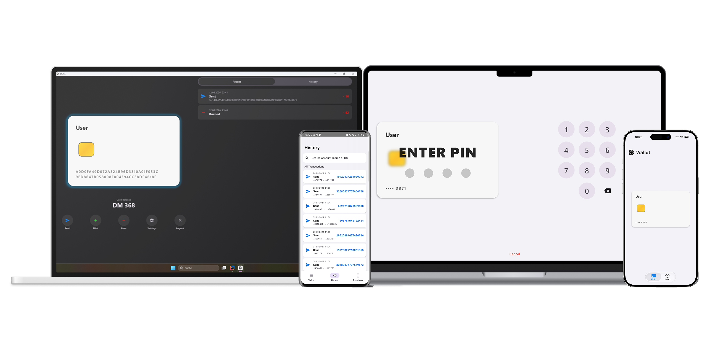
</p>

<p align="center">
  <a href="https://testflight.apple.com/join/2J7gNTJ4">
    
  </a>
</p>

This version was developed as a bachelor thesis at the University of Basel. It replaces the closed-source Ditto storage and synchronisation layer from the [original seminar prototype](https://github.com/dominikkipfer/DOLE/tree/seminar-project) with a transparent Rust implementation. DOLE is a research prototype, not a production payment system.

## How It Works

The shared Kotlin Multiplatform wallet drives the user flow and communicates with the card through NFC on Android and iOS or PC/SC on desktop systems. It passes signed operations to a native Rust core through UniFFI.

The Rust core performs P-256 verification, validates the card certificate against the root CA, and recovers the signing public key from non-genesis transaction signatures. This allows the compact wire format to omit a separate author identifier. Accepted transactions become Git commits on an author-specific branch; balances and history are derived from the verified ledger rather than trusted from the network.

Synchronisation exchanges compact transaction batches and Frontier messages. A peer compares the received Frontier with its own branches and transfers only the missing suffix. Devices can therefore catch up from a partial history without downloading transactions they already hold.

<div align="center">
<table align="center" style="margin-left: auto; margin-right: auto;">
  <tr><th>Path</th><th>Role</th></tr>
  <tr><td>Java Card</td><td align="left">Protects the private key, balance, role, counters, and per-peer receive state</td></tr>
  <tr><td>Kotlin Multiplatform</td><td align="left">Provides the shared wallet, account management, pending actions, and platform adapters</td></tr>
  <tr><td>Rust core</td><td align="left">Verifies transactions, maintains the Git ledger, encodes sync frames, and runs networking</td></tr>
  <tr><td>Iroh</td><td align="left">Provides local mDNS discovery, QUIC connectivity, gossip, and global hub connectivity</td></tr>
  <tr><td>BLE</td><td align="left">Provides connectionless offline exchange through extended advertisements on Android and Windows</td></tr>
  <tr><td>Hub</td><td align="left">Acts as an optional always-online Iroh bootstrap and gossip peer without storing the ledger</td></tr>
</table>
</div>

## Transport Support

<div align="center">
<table align="center" style="margin-left: auto; margin-right: auto;">
  <tr><th>Platform</th><th>Card access</th><th>Local Iroh</th><th>Global Iroh</th><th>BLE</th></tr>
  <tr><td>Android</td><td>NFC</td><td>Yes</td><td>Yes</td><td>Yes</td></tr>
  <tr><td>iOS</td><td>CoreNFC</td><td>Yes</td><td>Yes</td><td>No</td></tr>
  <tr><td>Windows</td><td>PC/SC</td><td>Yes</td><td>Yes</td><td>Yes</td></tr>
  <tr><td>macOS</td><td>PC/SC</td><td>Yes</td><td>Yes</td><td>No</td></tr>
</table>
</div>

Apple's public Bluetooth APIs do not expose the extended advertising functionality required by DOLE's connectionless BLE transport. Apple devices therefore use Iroh for synchronisation.

## Repository Structure

<div align="center">
<table align="center" style="margin-left: auto; margin-right: auto;">
  <tr><th>Path</th><th>Purpose</th></tr>
  <tr><td><code>app/shared</code></td><td align="left">Shared Kotlin logic, Compose UI, view model, and platform interfaces</td></tr>
  <tr><td><code>app/androidApp</code></td><td align="left">Android application and NFC integration</td></tr>
  <tr><td><code>app/desktopApp</code></td><td align="left">Windows and macOS application with PC/SC support</td></tr>
  <tr><td><code>app/iosApp</code></td><td align="left">iOS application, CoreNFC integration, and Swift bridge</td></tr>
  <tr><td><code>card</code></td><td align="left">Java Card wallet and NDEF applets plus provisioning tools</td></tr>
  <tr><td><code>core</code></td><td align="left">Rust cryptography, Git ledger, compact wire format, networking, and benchmarks</td></tr>
  <tr><td><code>hub</code></td><td align="left">Standalone Iroh gossip bootstrap peer</td></tr>
  <tr><td><code>constants.conf</code></td><td align="left">Protocol and platform constants generated for Rust, Kotlin, and Java</td></tr>
</table>
</div>

## Requirements

<div align="center">
<table align="center" style="margin-left: auto; margin-right: auto;">
  <tr><th>Component</th><th>Requirement</th></tr>
  <tr><td>Rust core</td><td align="left">Rustup with Cargo, Rust 1.85 or newer, and a native C/C++ toolchain</td></tr>
  <tr><td>Client runtime</td><td align="left">JDK 21</td></tr>
  <tr><td>Android</td><td align="left">Android Studio, Android SDK 37, Android NDK, and Android 8.0 or newer</td></tr>
  <tr><td>iOS</td><td align="left">macOS, Xcode with the iOS 26 SDK or newer, and an Apple developer team</td></tr>
  <tr><td>Smart card</td><td align="left">Java Card with EC curve support, such as the NXP J3R180 Classic 3.0.5</td></tr>
  <tr><td>Desktop card access</td><td align="left">USB PC/SC reader</td></tr>
</table>
</div>

All remaining project dependencies and Java Card build tools are downloaded automatically.

## Setup

All commands are executed from the repository root. Clone the repository and build it with the Gradle wrapper:

```shell
git clone https://github.com/dominikkipfer/DOLE.git
cd DOLE
./gradlew build
```

The platform-specific Rust targets described below must be installed before building the corresponding application.

### Smart Card

Connect a PC/SC reader, insert a blank card, and provision it as either a user card or a minter card:

```shell
./gradlew :card:setupUser
./gradlew :card:setupMinter
```

Run only one setup command for each card. Both tasks install the required applets before starting the interactive provisioner.

### Desktop

With a reader connected and a provisioned card inserted, start the desktop wallet on Windows or macOS:

```shell
./gradlew :app:desktopApp:run
```

### Android

Install Cargo NDK and the ARM64 Android Rust target:

```shell
cargo install cargo-ndk
rustup target add aarch64-linux-android
```

Run the application from Android Studio or install it on a connected device:

```shell
./gradlew :app:androidApp:installDebug
```

Grant the requested NFC, Bluetooth, and nearby-device permissions.

### iOS

Install the Rust targets for physical ARM64 devices and Apple-Silicon simulators:

```shell
rustup target add aarch64-apple-ios
rustup target add aarch64-apple-ios-sim
```

Open `app/iosApp/iosApp.xcodeproj` in Xcode. Select an Apple developer team and a physical iOS device, then build and run the application. The Xcode build phase builds the shared Kotlin XCFramework and Rust library automatically. A physical device is required for NFC access.

## Developer and Evaluation Tools

The Developer screen allows BLE, local mDNS, and online Iroh connectivity to be switched independently. It also shows discovered peers, the number of accounts and commits, and controls for workload generation, local-storage measurement, and transport latency. Benchmark results are written to the application log under `dole::bench`.

The compact transaction sizes used by synchronisation can be printed with:

```shell
cargo test --release --manifest-path core/Cargo.toml \
  --features bench-workload wire_size_stats_print_for_manual_inspection -- --nocapture
```

## Global Iroh Hub

Global Iroh synchronisation requires at least one continuously running hub. The repository already points to the public hub directory configured by `IROH_HUB_DIRECTORY_URL` in `constants.conf`. To use another hub directory, change that value and rebuild the project.

On the hub server, select a persistent storage directory, print the hub identifier, and start the hub:

```shell
export HUB_STORAGE="$HOME/.dole-hub"
cargo run --release --manifest-path hub/Cargo.toml -- --print-id
cargo run --release --manifest-path hub/Cargo.toml
```

Add the printed identifier to the publicly hosted `hubs.txt`, with one identifier per line. Empty lines and lines beginning with `#` are ignored. Keep the generated `hub.key`; it gives the hub its ID.

The hub joins the shared gossip topic and helps devices meet globally. It does not hold account keys, store the Git ledger, verify transactions, or act as a central authority.

## Limitations

BLE is the slowest transport because advertisements remain unchanged long enough for less reliable scanners to receive them. In practice this limits the offline path to roughly one transaction per second. BLE is unavailable on Apple platforms because the required extended advertising API is not public.

The global Iroh network uses a shared gossip topic, which keeps peer discovery simple but is not designed for an unrestricted production-scale payment network. The wallet also targets recent platforms: Android 8.0 or newer and iOS 26 or newer.

## Thesis Result

The Git-based implementation preserves the wallet behaviour of the earlier Ditto prototype while making storage, verification, and synchronisation inspectable. Its compact transaction representation and local store are substantially smaller than Ditto's. In the evaluation, Iroh achieved lower online transaction latency, while Ditto generally caught up larger histories faster. BLE remained the principal latency limitation.

## Demonstration

### Card Setup

A card is provisioned once as either a normal user card or a minter card. The wallet reads its certificate, creates the account, and writes the genesis transaction to the ledger. The same physical card can then be used with another DOLE device.

<p align="center">
  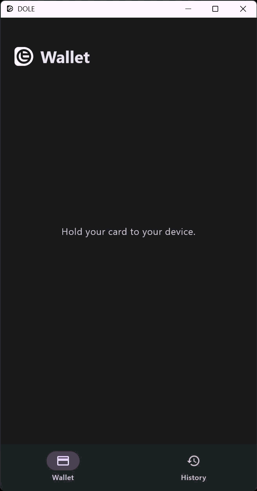
</p>

A normal user can send and burn funds. Only a certified minter card exposes minting in the unmodified wallet.

<p align="center">
  <strong>User card</strong>&nbsp;&nbsp;&nbsp;&nbsp;&nbsp;&nbsp;&nbsp;&nbsp;&nbsp;&nbsp;&nbsp;&nbsp;&nbsp;&nbsp;&nbsp;&nbsp;&nbsp;&nbsp;&nbsp;&nbsp;
  <strong>Minter card</strong>
</p>
<p align="center">
  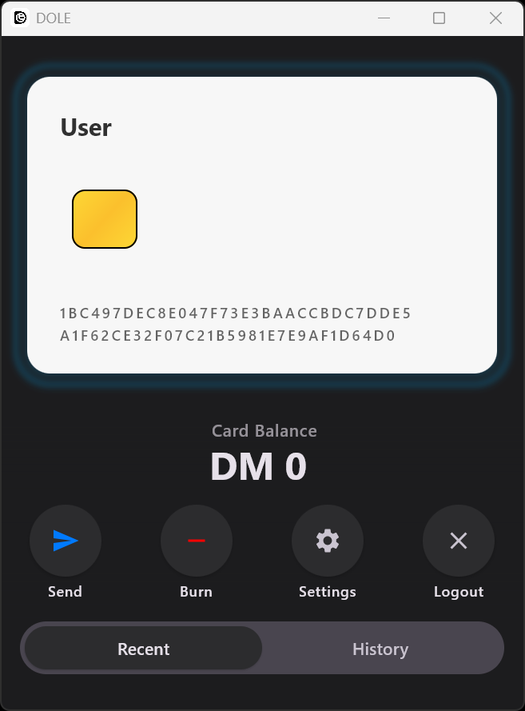&nbsp;&nbsp;
  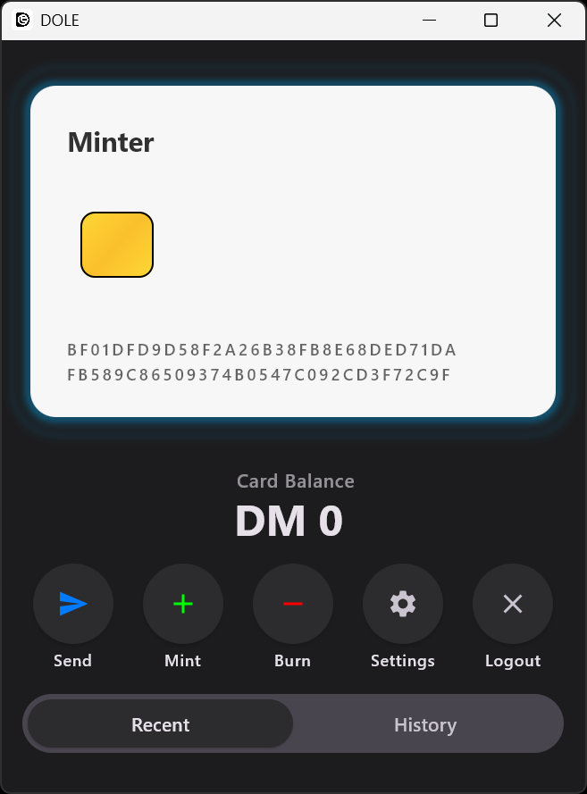
</p>

### PIN Protection

The PIN unlocks operations on the card but does not expose its private key. Incorrect attempts are counted by the card, and three failed attempts block further access.

<p align="center">
  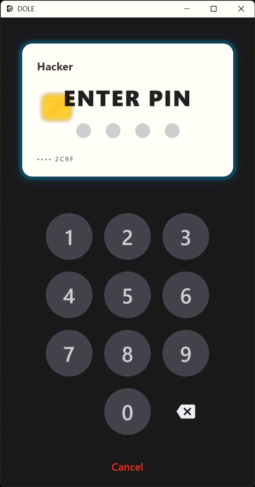
</p>

### Peer Discovery and Sending

Once another account's genesis branch has been discovered, the account appears in the recipient selector. The sender chooses the peer and amount and presents the card to authorise the transaction.

<p align="center">
  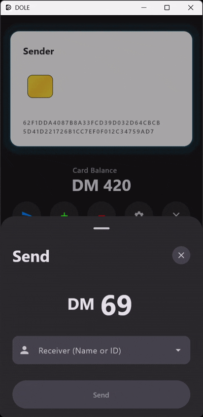
</p>

### Receiving

An incoming send remains pending until the recipient's card is present. After verification and processing by the card, the transaction moves to Recent and the card balance is updated.

<p align="center">
  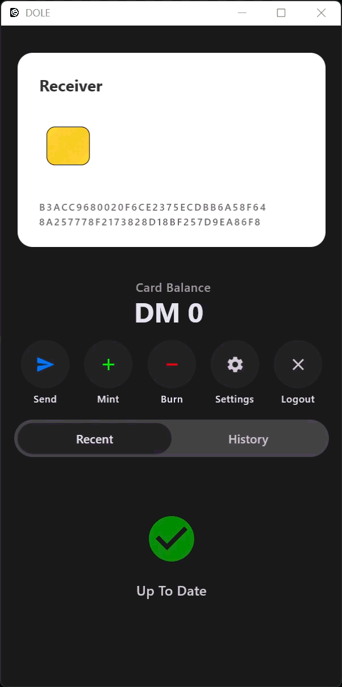
</p>

### Minting and Burning

Mint and burn operations also require the card. The applet updates its protected state and signs the transaction before the Rust core accepts it into the ledger.

<p align="center">
  <strong>Mint</strong>&nbsp;&nbsp;&nbsp;&nbsp;&nbsp;&nbsp;&nbsp;&nbsp;&nbsp;&nbsp;&nbsp;&nbsp;&nbsp;&nbsp;&nbsp;&nbsp;&nbsp;&nbsp;&nbsp;&nbsp;
  <strong>Burn</strong>
</p>
<p align="center">
  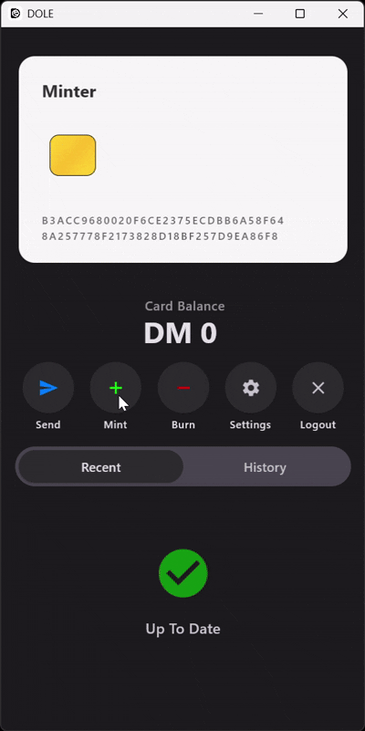&nbsp;&nbsp;
  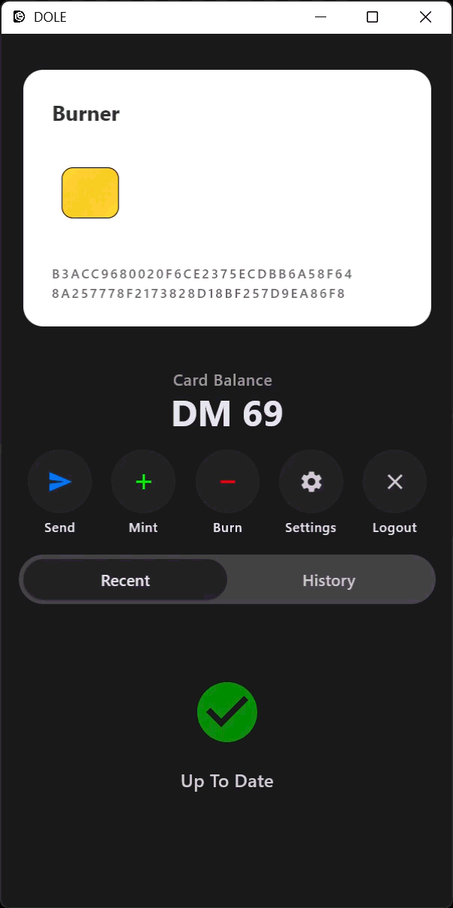
</p>

### Hardware-Enforced Roles

Even if a modified application displays the Mint button for a normal user, the card refuses the operation because the minter privilege is checked by the applet.

<p align="center">
  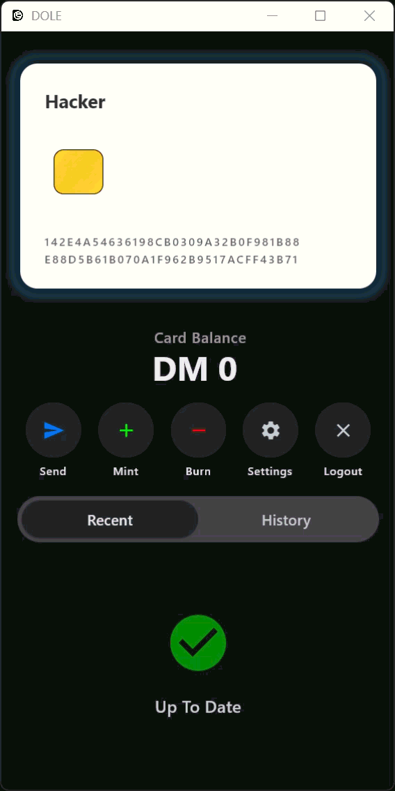
</p>

### Deduplication

BLE, local mDNS/Iroh, and global Iroh can be enabled independently. If the same transaction arrives through multiple transports, it is stored only once.

<p align="center">
  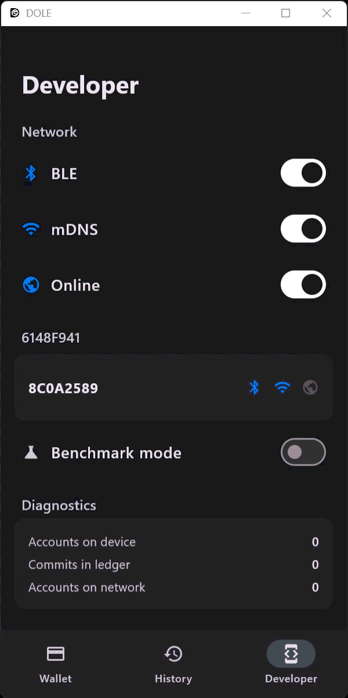
</p>
